# Guía de Integración con Servicios Externos

Esta guía explica cómo reactivar las integraciones con los servicios externos (Hotel, Aerolínea, Banco) cuando estén disponibles.

## 📋 Estado Actual

### Servicios Activos (Solución Turismo - Backend Principal)
- ✅ `/v1/auth/*` - Autenticación
- ✅ `/v1/clients/*` - Gestión de clientes
- ✅ `/v1/catalog/*` - Catálogo de ciudades

### Servicios Deshabilitados (Pendientes de Integración)
- 🔄 `/v1/cart/*` - Carrito de compras (requiere servicios Hotel/Aerolínea)
- 🔄 `/v1/checkout/*` - Proceso de pago (requiere servicio Banco)
- 🔄 `/v1/reservations/*` - Reservas (requiere servicios Hotel/Aerolínea)
- 🔄 `/v1/bookings/*` - Búsqueda de hoteles y vuelos

---

## 🔧 Pasos para Integrar Servicios Externos

### 1️⃣ Servicio de Hoteles

**Requisitos previos:**
- Servicio Hotel corriendo en su puerto (ej: `http://localhost:4000`)
- Backend Solución Turismo configurado para comunicarse con el servicio Hotel

**Archivos a modificar:**

#### `app/packages/confirm/page.tsx`
```typescript
// ANTES (línea ~14):
// import { useAddCartItem } from "@/lib/hooks/useCart"; // Deshabilitado: servicios externos

// DESPUÉS:
import { useAddCartItem } from "@/lib/hooks/useCart";

// ANTES (línea ~86):
// const addCartItem = useAddCartItem(); // Deshabilitado: requiere servicios externos (Hotel, Banco)

// DESPUÉS:
const addCartItem = useAddCartItem();

// ANTES (líneas ~203-215 - código comentado):
// TODO: Integración futura con backend de carrito cuando los servicios externos estén listos
// Por ahora guardar solo localmente para pruebas de Solución Turismo
console.log('📦 Guardando paquete localmente (servicios externos pendientes):', {...});

// DESPUÉS (descomentar y usar):
// Add package to cart - backend requiere hotelId, roomId, checkIn, checkOut
await addCartItem.mutateAsync({
  clientId,
  currency: 'COP',
  kind: 'HOTEL',
  refId: hotel.hotel_id,
  quantity: roomsRequested,
  price: totalEstimated,
  metadata: {
    hotelId: hotel.hotel_id,
    roomId: finalRooms[0]?.habitacion_id || '',
    checkIn: searchDetails.checkIn,
    checkOut: searchDetails.checkOut,
    hotelName: hotel.nombre,
    rooms: finalRooms.map(r => ({ id: r.habitacion_id, type: r.tipo, price: r.precio })),
    nights,
    adults: searchDetails.adults,
  }
});
```

**Verificación:**
```bash
# Test del endpoint
curl -X POST http://localhost:3000/v1/cart/items \
  -H "Authorization: Bearer YOUR_TOKEN" \
  -H "Content-Type: application/json" \
  -d '{
    "clientId": "CC-123",
    "currency": "COP",
    "kind": "HOTEL",
    "refId": "HOT-001",
    "quantity": 1,
    "price": 500000,
    "metadata": {
      "hotelId": "HOT-001",
      "roomId": "HAB-001",
      "checkIn": "2025-12-01",
      "checkOut": "2025-12-05"
    }
  }'
```

---

### 2️⃣ Servicio de Aerolíneas

**Requisitos previos:**
- Servicio Aerolínea corriendo en su puerto (ej: `http://localhost:5000`)
- Backend Solución Turismo configurado para comunicarse con el servicio Aerolínea

**Archivos a modificar:**

#### `app/flights/confirm/page.tsx`
```typescript
// ANTES (líneas ~14-15):
// import { useAddCartItem } from "@/lib/hooks/useCart"; // Deshabilitado: servicios externos
// import { useCheckoutQuote } from "@/lib/hooks/useCheckout"; // Deshabilitado: servicios externos

// DESPUÉS:
import { useAddCartItem } from "@/lib/hooks/useCart";
import { useCheckoutQuote } from "@/lib/hooks/useCheckout";

// ANTES (líneas ~90-96):
// const addCartItem = useAddCartItem(); // Deshabilitado: servicios externos
const [validationError, setValidationError] = useState<string | null>(null);
const [isProcessing, setIsProcessing] = useState(false);

// Use checkout quote if available to get real total
// const checkoutQuoteDto = clientId ? { clientId } : undefined;
// const { data: quoteData } = useCheckoutQuote(checkoutQuoteDto); // Deshabilitado: servicios externos

// DESPUÉS:
const addCartItem = useAddCartItem();
const [validationError, setValidationError] = useState<string | null>(null);
const [isProcessing, setIsProcessing] = useState(false);

// Use checkout quote if available to get real total
const checkoutQuoteDto = clientId ? { clientId } : undefined;
const { data: quoteData } = useCheckoutQuote(checkoutQuoteDto);

// ANTES (líneas ~160-168 - código comentado):
// TODO: Integración futura con backend de carrito cuando los servicios externos estén listos
console.log('✈️ Guardando vuelo localmente (servicios externos pendientes):', {...});

// DESPUÉS:
// Add flight to cart
await addCartItem.mutateAsync({
  clientId,
  currency: 'COP',
  kind: 'AIR',
  refId: flight.flightId,
  quantity: searchDetails.passengers,
  price: flightTotal,
  metadata: {
    flightId: flight.flightId,
    origin: searchDetails.origin,
    destination: searchDetails.destination,
    departureDate: searchDetails.departureDate,
    returnDate: searchDetails.returnDate || null,
    airline: flight.airline,
    departureTime: flight.departureTime,
    arrivalTime: flight.arrivalTime,
    duration: flight.duration,
    selectedClasses: selectedClasses.map(c => ({ className: c.className, price: c.price })),
  }
});

// ANTES (línea ~197):
// Calculate total (sin quote del backend por ahora)
const totalAmount = packageTotal + flightTotal;

// DESPUÉS:
// Use quote total if available, otherwise calculate
const totalAmount = quoteData?.total || (packageTotal + flightTotal);
```

**Verificación:**
```bash
# Test búsqueda de vuelos
curl -X POST http://localhost:3000/v1/bookings/air/search \
  -H "Authorization: Bearer YOUR_TOKEN" \
  -H "Content-Type: application/json" \
  -d '{
    "origin": "BOG",
    "destination": "MDE",
    "departureDate": "2025-12-01",
    "adults": 2,
    "classType": "ECONOMY"
  }'

# Test agregar al carrito
curl -X POST http://localhost:3000/v1/cart/items \
  -H "Authorization: Bearer YOUR_TOKEN" \
  -H "Content-Type: application/json" \
  -d '{
    "clientId": "CC-123",
    "currency": "COP",
    "kind": "AIR",
    "refId": "FL-001",
    "quantity": 2,
    "price": 800000,
    "metadata": {
      "flightId": "FL-001",
      "origin": "BOG",
      "destination": "MDE",
      "departureDate": "2025-12-01"
    }
  }'
```

---

### 3️⃣ Servicio de Banco/Pagos

**Requisitos previos:**
- Servicio Banco corriendo en su puerto (ej: `http://localhost:6000`)
- Backend Solución Turismo configurado para comunicarse con el servicio Banco

**Archivos a modificar:**

#### `app/bank/page.tsx`
Actualmente este archivo ya debería estar usando el servicio de pagos. Verificar que:

```typescript
import { usePaymentInitiate } from "@/lib/hooks/usePayments";

// En el componente:
const initPayment = usePaymentInitiate();

const handlePayment = async () => {
  const result = await initPayment.mutateAsync({
    clientId,
    currency: 'COP',
    totalAmount: paymentInfo.totalAmount,
    description: paymentInfo.description,
    returnUrl: `${window.location.origin}/bank/response`,
    callbackUrl: `${process.env.NEXT_PUBLIC_API_URL}/payments/webhook`,
  });
  
  // Redirigir al banco
  if (result.bankPaymentUrl) {
    window.location.href = result.bankPaymentUrl;
  }
};
```

**Verificación:**
```bash
# Test iniciar pago
curl -X POST http://localhost:3000/v1/payments/init \
  -H "Authorization: Bearer YOUR_TOKEN" \
  -H "Content-Type: application/json" \
  -H "Idempotency-Key: $(uuidgen)" \
  -d '{
    "clientId": "CC-123",
    "currency": "COP",
    "totalAmount": 1500000,
    "description": "Paquete + Vuelo",
    "returnUrl": "http://localhost:3001/bank/response"
  }'
```

---

### 4️⃣ Servicio de Reservas

**Requisitos previos:**
- Los servicios Hotel y Aerolínea deben estar funcionando
- Backend configurado para crear reservas después de pagos exitosos

**Archivos a modificar:**

#### `app/profile/bookings/page.tsx`
```typescript
// ANTES (línea ~4):
// import { useReservations } from "@/lib/hooks/useReservations"; // Deshabilitado: servicios externos

// DESPUÉS:
import { useReservations } from "@/lib/hooks/useReservations";

// ANTES (línea ~16):
// const { data: backendReservations, isLoading, error } = useReservations(clientId); // Deshabilitado: servicios externos

// DESPUÉS:
const { data: backendReservations, isLoading, error } = useReservations(clientId);

// ANTES (líneas ~30-32):
// Por ahora usar solo datos locales (sin backend de reservas - servicio externo)
const hasBookings = localBookings.length > 0 || localFlightBookings.length > 0;

/* Temporalmente deshabilitado - requiere servicios externos
if (isLoading) { ... }

// DESPUÉS (descomentar toda la lógica de loading/error/backend):
const { data: backendReservations, isLoading, error } = useReservations(clientId);

if (isLoading) {
  return (
    <div className="space-y-6">
      <div>
        <h3 className="text-lg font-medium">{t("Mis Reservas", "My Bookings")}</h3>
        <p className="text-sm text-muted-foreground">
          {t("Cargando reservas...", "Loading bookings...")}
        </p>
      </div>
      <div className="space-y-4">
        {[1, 2, 3].map((i) => (
          <Card key={i}>
            <CardHeader>
              <Skeleton className="h-6 w-48" />
              <Skeleton className="h-4 w-32 mt-2" />
            </CardHeader>
            <CardContent>
              <Skeleton className="h-20 w-full" />
            </CardContent>
          </Card>
        ))}
      </div>
    </div>
  );
}

if (error) {
  // Mostrar error pero mantener reservas locales como fallback
}

// Priorizar backendReservations sobre localBookings
const hasReservations = backendReservations && backendReservations.length > 0;
```

**Verificación:**
```bash
# Test obtener reservas
curl -X GET "http://localhost:3000/v1/reservations?clientUuid=CC-123" \
  -H "Authorization: Bearer YOUR_TOKEN"

# Test crear reserva (normalmente se hace automáticamente después del pago)
curl -X POST http://localhost:3000/v1/reservations \
  -H "Authorization: Bearer YOUR_TOKEN" \
  -H "Content-Type: application/json" \
  -d '{
    "clientUuid": "CC-123",
    "currency": "COP",
    "totalAmount": 1500000,
    "note": "Paquete Cartagena + Vuelo"
  }'
```

---

## 🔄 Flujo Completo Integrado

Una vez todos los servicios estén activos:

```mermaid
graph TD
    A[Usuario busca paquete] --> B[Backend consulta Hotel Service]
    B --> C[Usuario selecciona hotel]
    C --> D[Agregar al carrito via POST /cart/items]
    D --> E[Usuario busca vuelo]
    E --> F[Backend consulta Airline Service]
    F --> G[Usuario selecciona vuelo]
    G --> H[Agregar vuelo al carrito via POST /cart/items]
    H --> I[Checkout: POST /checkout/quote]
    I --> J[Usuario confirma compra]
    J --> K[POST /checkout/confirm]
    K --> L[POST /payments/init con Banco Service]
    L --> M[Redirige a pasarela del banco]
    M --> N[Banco procesa pago]
    N --> O[Webhook a /payments/webhook]
    O --> P[Backend crea Reserva automáticamente]
    P --> Q[Usuario ve reserva en GET /reservations]
```



---

## ✅ Checklist de Integración

### Antes de empezar:
- [ ] Servicios externos (Hotel, Aerolínea, Banco) están corriendo
- [ ] Backend principal configurado con URLs de servicios externos
- [ ] Variables de entorno actualizadas
- [ ] Tokens/credenciales configuradas

### Para cada servicio:
- [ ] Descomentar imports en los archivos correspondientes
- [ ] Descomentar hooks (`useAddCartItem`, `useCheckoutQuote`, `useReservations`)
- [ ] Descomentar llamadas `mutateAsync` al backend
- [ ] Eliminar `console.log` de pruebas
- [ ] Probar endpoint con curl/Postman
- [ ] Verificar en UI que funciona end-to-end
- [ ] Actualizar manejo de errores si es necesario

### Finalmente:
- [ ] Eliminar stores locales obsoletos (opcional, pueden servir como fallback)
- [ ] Actualizar README con la nueva arquitectura
- [ ] Documentar endpoints de servicios externos
- [ ] Configurar monitoreo/logging para servicios

---

## 🐛 Troubleshooting

### Error: "No QueryClient set"
- ✅ Ya resuelto - `QueryClientProvider` está en `app-wrapper.tsx`

### Error 400: "metadata para HOTEL requiere hotelId, roomId..."
- ✅ Ya resuelto - metadata incluye campos requeridos

### Error 401: "Unauthorized"
- Verificar que el token JWT se está enviando correctamente
- Check `localStorage.getItem('auth_token')` en DevTools
- Verificar que `AuthProvider` está configurado

### Error 404 en endpoints
- Verificar que servicios externos están corriendo
- Check configuración de proxy en backend
- Verificar URLs en variables de entorno

### Reservas no aparecen
- Verificar que el pago se completó exitosamente
- Check webhook `/payments/webhook` recibió notificación
- Revisar logs del backend para creación de reserva

---

## 📞 Contacto

Para dudas sobre integración:
- Backend principal (Solución Turismo): [Equipo Backend]
- Servicio Hotel: [Equipo Hotel]
- Servicio Aerolínea: [Equipo Aerolínea]
- Servicio Banco: [Equipo Banco]

---

**Última actualización:** 24 de noviembre de 2025
**Versión:** 1.0
